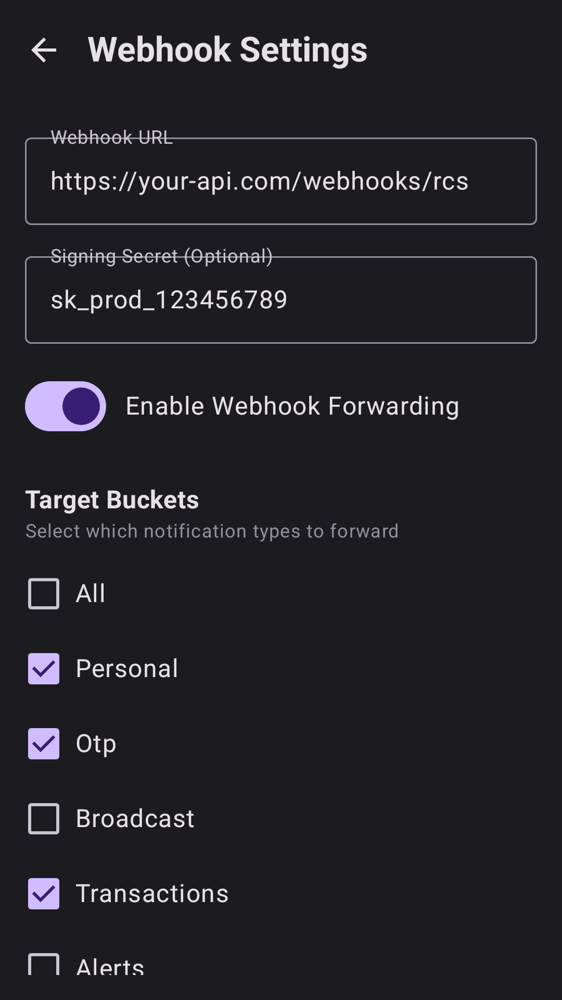
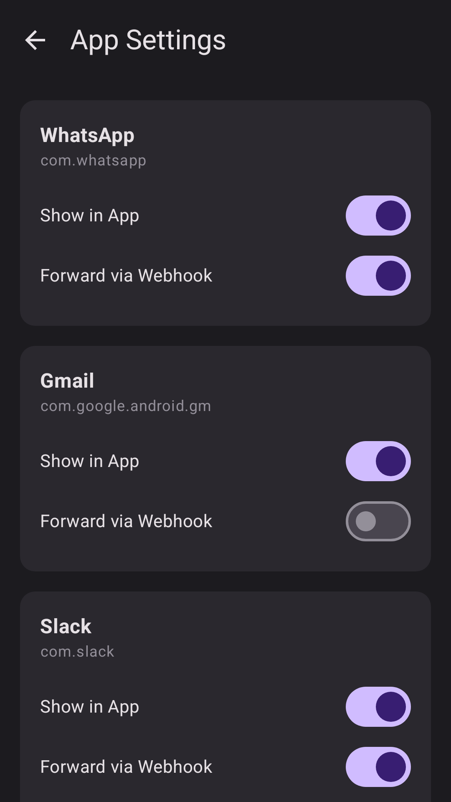

# YourNotifications

YourNotifications is a native Android application designed to handle notification forwarding and filtering via webhooks. It allows users to route specific notification buckets (Personal, OTP, Transactions, etc.) to custom API endpoints for further processing or archival.

## Features

- **Webhook Forwarding**: Automatically forward incoming notifications to a configured URL.
- **Granular Filtering**: Select specific applications or notification categories (buckets) to forward.
- **Native Experience**: Built with Jetpack Compose for a modern, fluid material design experience.
- **Secure**: Supports signing secrets for webhook verification.
- **Android 15 Ready**: Targets API level 35 for latest security and performance optimizations.

## Screenshots

<p align="center">
  
  
</p>

## Tech Stack

- **UI**: Jetpack Compose, Material 3
- **Database**: Room Persistence Library
- **Dependency Injection**: Hilt
- **Background Processing**: WorkManager
- **Testing**: Paparazzi (Snapshot Testing), JUnit

## Setup

1. Clone the repository.
2. Open in Android Studio.
3. Configure your local signing properties in `local.properties`:
   ```properties
   signing.storePassword=your_password
   signing.keyAlias=your_alias
   signing.keyPassword=your_password
   ```
4. Build and run!

## License

MIT License
